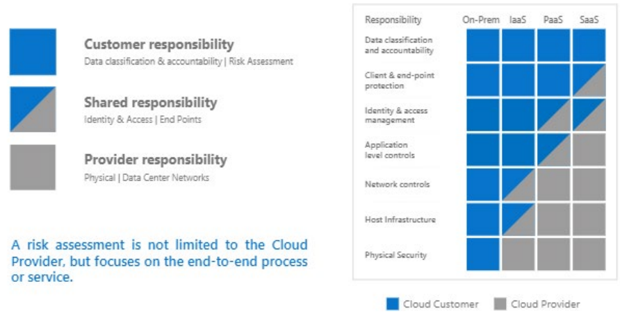

# Ansvarsmodell for offentlig sky

Før vi diskuterer felles utfordringer, løsninger og arkitektur er det viktig å forstå hvordan asnvarsmodellen ser ut i sky og hvordan valg av ulike tjenester/komponenter spiller inn på ansvarsområde man har og hva man må sikre.

De fleste kunder som har sky tjenester idag har en god kombinasjon av IaaS/PaaS og SaaS tjenester.

Dette kan forenkle driftsmodellen betraktelig slik overnevnte modell viser - i motsetning til at man kjører alt i eget datasenter (on-prem) hvor man er ansvarlig ansvarlig for alt fra fysisk sikring av bygninger, infrastruktur og hele veien oppover i 'stacken'. 

