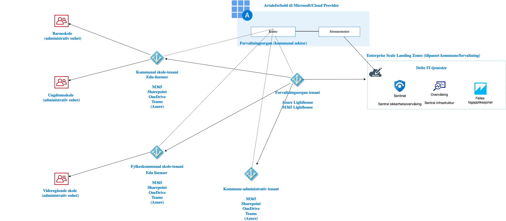
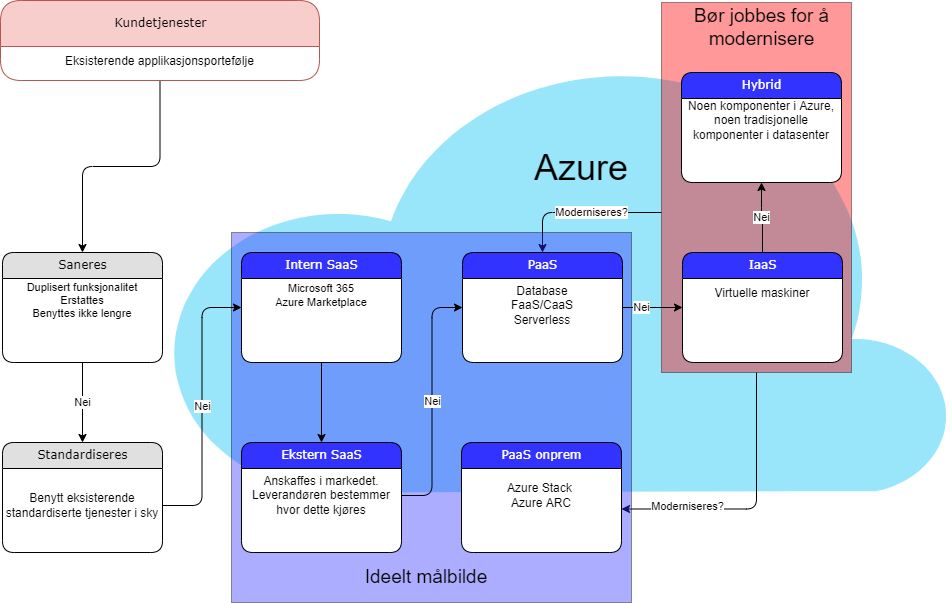
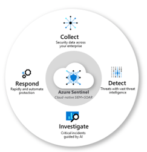

# Referansearkitektur og hybrid

Rent overordnet kan man se på en helhetlig arkitektur hvor vi skiller på hva som lovmessig må ligge i egne datasentere/edge (lovmessig reguleringer og krav eller sammfunnskritikalitet) og hvordan vi klassifiserer ulike applikasjoner som plasseres i sky, edge eller on-premises.

En Hybrid arkitektur bør understøtte applikasjoner som deployes 'hvorsomhelst' - fra helt på kanten (edge - eksempelvis på et sykehus eller på en kiosk/terminal til egne datasentere og helt opp til offentlig sky). Applikasjonkrav- (lover, latens og kritikalitet) og modenhet (utviklet med moderne teknologi) bør avgjøre hvor applikasjoner deployes. For å få til dette kreves ett hybrid skyoppsett - hvor onprem og skyen er koblet sammen. 

*** Overordnet bilde ***

## Identitetsløsning for kommunal sektor

Azure Active Directory (Azure AD) benyttes som identitietsløsning:

{ width=90% }

Denne arkitekturen er tiltenkt et scenario hvor et felles forvaltningsorgan drifter og tilrettelegger sky-løsninger og IT-infrastruktur for flere kommuner og en fylkeskommune.

Det er etablert et sett med leietakere (tenants) i denne referanse-arkitekturen:

- Forvaltningsorgan
    - Benyttes primært for sentral administrasjon av andre tenants via delegerte tilganger og Azure Lighthouse
- Kommunal skole
    - Rabattert lisensiering for Microsoft 365-tjenester (Edu-lisenser)
    - [Administrative enheter](https://docs.microsoft.com/en-us/azure/active-directory/roles/administrative-units)  Azure AD benyttes for delegert administrasjon per skole
- Kommunal administrasjon
    - Synkronisert mot lokale katalogtjenester via [Azure AD Cloud Sync](https://docs.microsoft.com/en-us/azure/active-directory/cloud-sync/what-is-cloud-sync)
- Fylkeskommunal skole
    - Rabattert lisensiering for Microsoft 365 tjenester (Edu-lisenser)

Skole og administrasjon er adskilt grunnet behov for et galvanisk skille mellom disse miljøene. Admistrativ tenant vil også inneholde brukere, grupper og andre typer objekter som brukes for tilgang til sensitive tjenester innen helse med mer - og har strengere behov for drift, forvaltning og sikkerhet enn utdannings-miljøer som omfattes av andre regelverk.

Kommunal- og fylkeskommunal skole er separert i dedikerte tenants i den initielle arkitekturen, men teknisk sett kunne disse vært slått sammen i en tenant. Hovedårsaken til et skille er at fylkeskommuner og kommuner er selvstendige offentlige myndighetsorgan som tradisjonelt har separate IT-organisasjoner, så her trengs innspill fra disse organisasjonene ift mulig endringer.

## Feide-innlogging

[Feide](https://www.feide.no/om-feide) er den nasjonale løsningen for sikker innlogging og datadeling i utdanning og forskning.
Våren 2022 fikk Feide støtte for innlogging med Azure AD-autentisering, noe som gjør det mulig for elever og lærere å logge på tjenester som støtter Feide med sin Microsoft-konto.

## Principle of Least Privilege
I [prinsippet om least privilege](https://en.wikipedia.org/wiki/Principle_of_least_privilege) skal en brukerkonto eller en prosess kun ha tilgang til det som kreves for å kunne utføre oppgaven, og gjerne kun i den perioden oppgaven utføres hvis mulig. Og kontoen bør ellers ha så lite rettigheter som mulig.

Dette prinsippet henger også tett sammen med det neste avsnittet om å skille tilgangsnivå på brukere.

## Skill tilgangsnivå på brukerkontoer
For brukere med høye tilgangsnivåer skal brukerkontoene som er gitt rettighetene skilles ut i egne brukere, og ikke gis til brukerens vanlige brukerkonto som brukes til å logge på PC-en og lese e-post med.

Eksempel på høye tilgangsnivåer:
* Azure AD-roller, som Global administrator, User administrator, Security administrator, osv.
* Tilgang til produksjonsmiljø for en tjeneste som kjører i en Azure subscription.

De samme prinsippene gjelder ikke kun for sky, men også on-premises-miljøer.

Illustrasjonen fra Microsoft viser tre ulike sikkerhetsnivåer for å skille brukerkontoer avhengig av rettighetene deres.

For mer informasjon, se Microsofts dokumentasjon på temaet: [https://docs.microsoft.com/en-us/security/compass/privileged-access-accounts](https://docs.microsoft.com/en-us/security/compass/privileged-access-accounts).

## Klassifiseringmatrise for applikasjoner
Her er et forsøk på hvordan vi kan tenke rundt klassifisering/skille av applikasjoner:

- Publikumstjeneste/Applikasjon (Internett eksponert)
- Intern applikasjon (interne ansatte)
- Ikke PII/sensitivt
- PII/Sensitivt
- Begrenset (Sikkerhetsloven)
- Konfidensielt (Sikkerhetsloven)
- Ikke sammfunnskritisk (tåler noe nedetid)

Samfunnskritiske tjenester som må kjøre og være tilgjengelig er delt på tvers av lokasjoner/uavhengig av lokasjon.

Sluttbrukere eller systemer - bruker internet (VPN eller MPLS) eller telefoni for å nå tjenester.

- Samfunnskritiske - lokale tjenster (edge & hybrid)
Samfunnskritiske tjenester må fungere i nødssituasjon hvor deler faller ut og tåler lite/eller ingen nedetid eller er svært sensitive til latens.

Sluttbrukere/systemer befinner seg lokalt (e.g. et sykehus/ambulanse) mm.

## Plan for tjenesteporteføljen

I forbindelse med etablering av en sky-strategi bør tjenesteporteføljen evalueres. Prinsipper for hvordan tjenesteporteføljen skal håndteres må etableres. Det anbefales å sanere tjenester der det lar seg gjøre, og standardisere og modernisere tjenestene man sitter igjen med. Jo mer moderne teknologi tjenestene støtter (som PaaS/Serverless) jo bedre og billigere kan de kjøre i sky samt moderne onprem miljø. Tjenester består ofte av flere komponenter. Hvis mulig anbefales det å flytte alle  komponentene til en tjeneste til skyen. Ofte lar dog dette seg ikke gjøre ved første forsøk, og da ender man opp med en hybrid tjeneste som man kan jobbe med å utvikle og migrere til sky. Følgende flyt-diagram viser hvordan en slike evaluering kan gjøres:

PaaS onprem kan være en god løsning for tjenester som må stå i lokale datasentre grunnet regulativer, latens, etc.

## On-premises

Dette er servere (virtualisert eller bare-metal) du har i dine egne datasentere hvor du kan drifte deler av applikasjonsporteføljen i et hybrid miljø.

## Nettverk

I et hybrid scenario (hybrid sky) som dette whitepaperet fokuserer på opprettes en tilkobling mellom Azure og det lokale nettverket. Dette for strekking av lokale tjenester (som integrasjoner) til sky, samt å kunne nå sky-tjenester ifra lokalt nettverk. Denne utveklsingen av data gjøres på en sikker måte via en kryptert privat forbindelse slik som Site-to-Site VPN eller Azure ExpressRoute Direct.

Det er viktig å kjenne til at ExpressRoute er en privat kobling til Azure men den er ikke kryptert hvis man ikke bruker ExpressRoute Direct, som har mulighet før MACSec. Når man bygger koblinger fra datasenter eller kontor med ExpressRoute må man vurdere om alle protokoller som benyttes er krypterte eller om man må bruke VPN over Expressroute. De fleste moderne protokoller er allerde kryptert, men i ett moderniserings-prosjekt er det mulig att man må legge til kryptering (grunnet legacy trafikk).

Dersom det er et behov for mange klienter og/eller kontor som skal nå Azure over VPN/Express Route - så anbefales det å benytte Azure Virtual WAN. Dette forenkler ruting mellom nettverk både internt i Azure og hybride forbindelser mot lokale nettverk. Alternativet er en tradisjonell hub/spoke topologi hvor man manuelt håndterer ruting, noe som fort kan bli komplekst i store miljøer.

## Sikring av nettverk

I Azure finnes det mange aspekter av nettverkssikkerhet. På mange måter kan man designe en nettverkstopolgi som ligner et tradisjonelt datasenter med mikrosegmentering mm.

Ser man på kommunal sektor har en tradisjonell sone-inndeling vært benyttet i stor grad, hvor grunnkonseptet er en administrativ sone (ofte kalt "åpent nett") plassert bak en "ytre brannmur" mot internett hvor vanlige klienter er plassert. I tillegg har man en sikker sone som er plassert bak en "indre brannmur". Det er som regel kun servere som kjører fagsystemer med sensitive data (typisk innen helsesektoren) og terminalservere som er plassert i den sikre sonen - hvor brukere aksesserer applikasjonene via publisert skrivebord (typisk Remote Desktop eller Citrix).

Videre har det vært vanlig med helt separat infrastruktur for skole/utdanning, med eksempelvis dedikerte nettverk med tilhørende dedikert instans av Active Directory - som er synkronisert ut til en egen Azure AD tenant.

Før man går i nærmere detaljer på hvordan dette anbefales i et sky-miljø bør man se på den helhetlige tilnærmingen til sikkerhet og identitet i skyen.

## Sikkerhet i skyen

Når det kommer til hvem som er ansvarlig for sikkerhet i et skymiljø er dette generelt sett et felles ansvar mellom kunde og leverandør, men det er ulike grenser for ulike tjenestemodeller:

For Software as a Service (SaaS)-tjenester slik som Office 365 hvor Microsoft drifter all underliggende infrastruktur har kunden «kun» ansvar for tilgangsstyring og data lagret inne i tjenestene. Infrastruktur rundt tjenestene slik som servere, nettverksinfrastruktur, høytilgjengelighet med mer håndteres av Microsoft.

Når det kommer til Azure er det flere tjeneste-modeller inne i bildet:
- **Infrastructure as a Service (IaaS)** – Lagring, nettverk og virtuelle maskiner – hvor kunden selv har ansvaret for elementer som vedlikehold av operativsystem (pathing), eksponering av tjenester mot internett med mer.
- **Platform as a Service (PaaS)** – Eksempelvis Azure SQL og lagringskontoer, hvor underliggende infrastruktur driftes og vedlikeholdes av Microsoft. Kunden konsumerer data-laget.

Microsoft har over flere år tilstrebet og anbefalt en «nulltillits-modell» (Zero Trust), hvor grunnprinsippene er:

- **Bekreft eksplisitt** – Valider alltid identitet, enheters helse og uregelmessige bruksmønstre
- **Benytt lavest privilegerte tilgang** – For å sikre både data og produktivitet, begrens brukertilganger ved hjelp av «Just In Time access» (JIT), «Just Enough Access» (JEA) og risikobaserte adaptive tilgangspolicyer
- **Anta sikkerhetsbrudd** – Minimer spredningsradiusen ved innbrudd ved å segmentere tilgang etter nettverk, brukere, enheter og applikasjoner. Krypter alle sesjoner ende-til-ende. Benytt analyseverktøy for å oppdage trusler, få innsikt etter eventuelle innbrudd og for å forbedre forsvar og sikkerheten.

Dette er en stor endring fra tradisjonelle tilnærminger:

Der hvor man tidligere satt fysisk på en arbeidsstasjon i det lokale nettverket benyttes det nå i stor grad mobile enheter (laptoper, nettbrett, mobiler, med mer) og hjemme/hyttekontor.

Identitet har derfor blitt en ny viktig faktor for sikring, hvor bruk av multifaktor-autentisering og policy-basert styring har blitt essensielle virkemidler. Som en konsekvens av endrede bruksmønstre ser vi at identitet har blitt en sterkere sikkerhets-mekanisme enn nettverk når det gjelder tilgang til produktivitetsløsninger som e-post og andre samhandlingsløsninger:

Når det kommer til infrastruktur har vi fremdeles behov for kontroll på nettverksnivået, men ved å følge Zero Trust prinsippene bør disse være mer segmenterte enn tidligere. Mikrosegmentering hvor det opprettes dedikerte nettverkssoner for hver enkelt applikasjon/løsning er derfor en anbefalt tilnærming.

En god del virksomheter har i prinsippet også en slik tilnærming for lokal infrastruktur i dag, hvor dedikerte nettverkssegmenter er opprettet for IoT-enheter og ulike andre formål, slik som dedikerte subnet for fagapplikasjoner med ulike krav til sikkerhet.

Det anbefales at samme tilnærming videreføres i Azure, og at det etableres en sentral tilgangskontroll via en brannmur og/eller nettverkssikkerhetsgrupper (NSG - Network Security Groups). NSGer – som forenklet kan ses på som aksesslister tildelt til virtuelle nettverkskort - skalerer til et visst punkt, hvor det typisk blir nødvendig med en sentral styringsmekanisme for enklere administrasjon og oversikt.

Azure Firewall er en PaaS-tjeneste for nettopp dette formålet, som på generell basis anbefales fremfor 3. parts appliance-løsninger for lavere TCO (Total Cost of Ownership).

## Verktøy

For å understøtte Zero Trust-prinsippene har Microsoft en hel del verktøy og tjenester som er relevante i kontekst av sikkerhet i Azure:

•	**Defender for Cloud Apps** – En såkalt ”Cloud Access Security Broker” som primært fokuserer på SaaS-tjenester for å få en total oversikt over tjenester i bruk (avdekke eventuelle «Shadow IT»-tjenester). I tillegg til tett integrasjon med Microsoft 365 finnes connectorer mot en hel del 3. parts skytjenester. Unormal aktivitet på tvers av skytjenester er et scenario som kan oppdages og varsles på med denne tjenesten.

•	**Azure AD Identity Protection** – Basert på en hel del signaler slik som lokasjon, IP-adresser og andre elementer vil denne tjenesten kunne avdekke potensielle farer og klassifisere risiko ved brukerpålogginger (Lav, Middels, Høy risiko) i Azure AD. Eksempel på et scenario er atypisk reise, hvor en bruker logger på fra 2 forskjellige land eller verdensdeler med kort mellomrom. Da vil denne tjenesten kunne konfigureres til å varsle og hvis ønskelig blokkere brukerkontoen, slik at man har automatisk blokkering for scenarier hvor en brukerkonto kan ha blitt kompromittert.

•	**Defender for Identity** – En skytjeneste som samler informasjon og signaler fra on-prem Active Directory i form av sensorer/agenter på domenekontrollere. Tjenesten kan avdekke scenarier som «lateral movement», hvor en kompromittert konto benyttes for å logge seg på videre inn til andre servere eller klienter.

•	**Defender for Cloud** – En skytjeneste som kontinuerlig scanner tjenester i et Azure-abonnement for å gi et innblikk i sikkerhetskonfigurasjon og tilby anbefalinger for å øke sikkerheten. Det er flere under-tjenester som kan aktiveres som en del av denne tjenesten

 - Microsoft Defender for Servers
 - Microsoft Defender for Storage
 - Microsoft Defender for SQL
 - Microsoft Defender for Containers
 - Microsoft Defender for App Service
 - Microsoft Defender for Key Vault
 - Microsoft Defender for Resource Manager
 - Microsoft Defender for DNS
 - Microsoft Defender for open-source relational databases
 - Microsoft Defender for Azure Cosmos DB (Preview per Mars 2022)

Hver av disse undertjenestene har egne pris-modeller, eksempelvis Microsoft Defender for Servers har en sum per måned per server som modell – mens Defender for Resource Manager er priset basert på antall forespørsler som går gjennom Azure Resource Manager (API-tjenester hvor alle Azure management-operasjoner går gjennom).

Defender for Servers kan også benyttes på maskiner utenfor Azure, slik som servere i eget datasenter eller andre skyplattformer. Tjenesten inkluderer lisens for Defender for Endpoint, og gir følgende ekstra funksjonalitet:

  - Verktøy for scanning av sårbarheter i operativsystemet – her kan man velge mellom Microsofts egen «threat and vulnerability»-løsning og en sårbarhets-scanner fra Qualsys (en av de ledende leverandørene av sanntids identifisering av sårbarheter) som er lisensiert som en del av tjenesten.
  - Docker nedlåsing – Containere som kjører inne i virtuelle maskiner scannes og sammenlignes opp mot CIS (Center for Internet Security) sine Docker Benchmarks.
  - Fil-løs angrepsdetektering – Angrep hvor payloads ikke lagres på disk, men kun kjøres i minne og typisk persisteres inne i kompromitterte prosesser oppdages og alarmeres på.
  - Auditd alarmer (for Linux) – auditd er et subsystem på kernel-nivå som er ansvarlig for å overvåke kall til kernel. Defender for Servers detekterer unormal aktivitet slik som tvilsomme prosesser og innlasting av ukjent kernel-moduler.

•	**Defender for IoT** – tjeneste som ikke går under Defender for Cloud, men som også er en viktig komponent rundt skysikkerhet. Produktet ble lansert i Januar 2021 som et resultat av et oppkjøp («CyberX»), og er myntet på enheter som i motsetning til laptoper og telefoner ikke støtter installasjon av agenter eller annen management-software. De går dermed på mange måter under radaren når det kommer til overvåking og synlighet overfor sikkerhetsansvarlige. Uten en slik synlighet er det veldig utfordrende å oppdage om enheter er kompromitterte. En rekke enheter for industrielle kontrollsystemer tilknyttet områder som elektrisitet, vann, transport, datasentre, smarte bygninger, farmasi, olje og gass samt andre kritiske løsninger går inn i denne kategorien enheter. Defender for IoT er agentløs, og har innebygd kjennskap til en stor mengde industrielle protokoller og benytter seg av utstrakt bruk av Machine Learning og automatiserte deteksjoner på samme måte som flere av Microsofts andre skysikkerhetsløsninger. For å benytte denne løsningen kan en fysisk eller virtuell appliance settes opp for mottak av kopi av nettverkstrafikk fra switcher (vha SPAN port eller TAP), slik at tjenesten ikke påvirker IoT-enhetene som overvåkes på noe vis. I videoen under ifra Microsoft Ignite, spilt inn kort tid etter oppkjøpet av CyberX, vises integrasjon med Microsoft Sentinel og hvordan alarmer for eksempelvis uautorisert PLS-programmering fanges opp.

•	**Microsoft Sentinel** – En SIEM (security information and event manager) platform basert på stor grad av innebygd AI (Artifical Intelligence) for analysering av store datamengder.

Selv om dette er en skytjeneste kan den også samle inn data fra hvor som helst, som for eksempel logger fra on-prem nettverksutstyr kan streames ut via syslog.

Det er over tid bygget opp et stort community rundt Sentinel, og man kan finne en rekke spørringer og såkalte playbooks både fra Microsoft og andre på steder som GitHub. Playbooks gjør det mulig å blant annet foreta automatiske handlinger basert på hendelser som oppstår, for eksempel å blokkere en bruker, sende varsel til en Teams-kanal eller å opprette en sak i et brukerstøttesystem slik som ServiceNow eller andre.

Det finnes også en hel del connectorer mot for eksempel Azure AD, aktivitetslogger i Azure, Defender for Cloud, Defender for Identity, Checkpoint, Cisco, AWS, Google med mange flere for innsamling av data. Sentinel vil dermed kunne være et sentralt nav for deteksjon og håndtering fra mange (potensielt alle) kilder som benyttes i en organisasjon.

•	**Azure Arc for Servers** – Dette er en tjeneste som gjør det mulig å prosjektere servere som kjører utenfor Azure inn som objekter i Azure. Dette muliggjør bruk av tagging slik at man har ett sted å samle metadata om servere. En annen funksjon som er kjernen i det denne tjenesten muliggjør er installasjon av [VM extensions](https://docs.microsoft.com/en-us/azure/azure-arc/servers/manage-vm-extensions), slik som Azure Monitor Agent og Defender for Servers. Andre eksempler som kan trekkes frem er Azure Automation Hybrid Runbook worker extension, som gjør det mulig å kjøre PowerShell og Python runbooks på on-prem servere. En annen er Azure Key Vault Certificate sync, som gjør det mulig å synkronisere et sertifikat fra et sentralt Key Vault ut mot flere servere.

## Conditional Access

Betinget tilgang (conditional access) er en funksjon i Azure Active Directory som gjør det mulig å definere policyer som forenklet sagt er et sett med «if then»-klausuler.

En rekke signaler samles og evalueres. Policyer kan defineres å gjelde all autentisering mot alle applikasjoner i Azure AD, eller granuleres per applikasjon. Mange har allerede definert slike policyer for tilganger til Microsoft 365.

Signaler som ofte brukes:

-	Gruppemedlemskap – for å begrense en policy eller tilgang til en bestemt gruppe brukere
-	IP lokasjonsinformasjon – IP-ranger som anses som trygge slik som bedriftens offisielle IP-adresse ut mot internett samt geografisk tilhørighet til offisielle adresser brukere logger på fra
-	Enheter – type operativsystem og informasjon om enheten er en del av Azure AD og/eller Active Directory
-	Applikasjon – spesifikke applikasjoner kan trigge dedikerte policyer
-	Sanntids risikoanalyse
    - Integrasjon med Azure AD Identity Protection for scenarier som atypiske reiser (pålogging fra 2 land med kort tids mellomrom)
-	Microsoft Defender for Cloud Apps
    - Muliggjør ytterligere innsikt i brukeres pålogginger og aktiviter

Basert på signaler kan ulike avgjørelser defineres:

-	Blokkere tilgang (den mest restriktive avgjørelsen)
-	Tillate tilgang
    - Betingelser hvor en eller flere av følgende påkreves
        - Multifaktor autentisering
        - Enhet må være markert som trygg (oppdaterte antivirus/malware-definisjoner som et eksempel)
        - Enhet må være hybrid Azure AD joined
        - Klient-applikasjonen som aksesseres må være forhåndsgodkjent

Ønsker man å begrense tilgang til administrasjonsverktøyene i Azure er det mulig å lage en policy som vil legge restriksjoner på tilgang via:

-	Azure portal
-	Azure Resource Manager provider
-	Classic Service Management APIs
-	Azure PowerShell
-	Visual Studio Subscriptions administrator portal
-	Azure DevOps
-	Azure Data Factory portal

Selv om en standard bruker ikke har noen tilganger i Azure vil man kunne logge på portal.azure.com, men ikke se noen abonnementer eller ressurser. Dette vil blokkeres for vanlige brukere ved innføring av en slik policy.

## Nettverk

### Private endepunkter

Et privat endepunkt i Azure er et virtuelt nettverkskort med en privat IP adresse fra et virtuelt nettverk man selv har opprettet, og som dermed kan tilgjengelig gjøres fra interne on-prem nettverk via ExpressRoute eller VPN. Dette nettverkskortet kobles til Azure Private Link for å bringe PaaS-tjenester inn i det interne nettverket.

Med dette oppnås en høyere grad av sikkerhet, siden ekstern tilgang for tjenester kan deaktiveres.

Selv om tjenester står eksponert direkte mot internett via offisielle IP-adresser betyr det ikke nødvendigvis at de er usikre. For eksempel et Key Vault kan likevel være sikret på identitetslaget i form av multifaktor-autentisering, på samme måte som en SaaS-tjenesten slik som Exchange Online.
En fordel med å bruke private endepunkter er bedre beskyttelse mot data-lekkasjer grunnet feil konfigurasjon av tilganger. Eksempelvis vil en mappe i en lagringskonto være åpent tilgjengelig via internett dersom rettighetene på mappen ved en feil er satt til anonym tilgang.
En annen fordel er at PaaS-tjenester som er konfigurert med private endepunkter kan aksesseres via ExpressRoute, og dermed unngå å måtte traversere internett. Det vil gi lavere latens, siden trafikken går via den private kommunikasjonslinjen fra ExpressRoute ISPen.

# Fysisk sikring av datasenter

Artikkelen [Azure security fundamentals documentation](https://docs.microsoft.com/en-us/azure/security/fundamentals/physical-security) inneholder en hel mengde informasjon om sikkerhet i sky - blant annet [denne artikkelen](https://docs.microsoft.com/en-us/azure/security/fundamentals/physical-security) som beskriver fasiliteter og fysisk sikkerhet på Microsofts datasentre.

Microsoft har også en [virtuell datasenter omvisning](https://news.microsoft.com/stories/microsoft-datacenter-tour/) som kan anbefales for å få et visuelt inntrykk av den fysiske sikkerheten.

På [Microsoft Service Trust Portal](https://servicetrust.microsoft.com/) er ytterligere dokumentasjon rundt valideringeringer utført av 3. parter opp mot industri-standarder tilgjengelig.

## Tekniske komponenter for sikring og compliance

### Azure Datasenter sikring

### Kryptering i Azure

Moderne nettverksprotokoll er krypterte og standardinstillingene på Azure Platform tjenster er att di er kryptert med TLS.

All data som lagres i Azure er også kryptert, standardinstillingene bruker krypteringsnøkler som Microsoft genererer og håndterer for kunden slik at alt er transparent. Hvis ønskelig kan man bruke kundeadministrerte krypteringsnøkler ("Customer Managed Keys"). Da må kunden håndtere disse selv og hvis man mister disse er dataene utilgjenglige.

### Azure HSM

Nøkkelhåndtering og hemmelighetshåndtering i Azure har flere nivåer av sikkerhet slik at hver kunde får sine behov trygget.

- Azure Key Vault Standard: Programvarebasert sikker nøkkelhåndtering.
- Azure Key Vault Premium: Har samme funksjonalitet som Standard men alle nøkler og hemmeligheter lagres på en maskinvarebasert sikkerhetsmodul (Hardware Security Module, HSM). FIPS 140-2.
- Azure Key Vault Managed HSM: Key Vault med dedikert maskinvarebasert sikkerhetsmodul. FIPS 140-3.
- Azure Dedicated HSM: Gir full tilgang til en maskinvarebasert Thales sikkerhetsmodul som er hostet i Azure Datasenter. Kan brukes som og kobles til On-Premise Thales HSMer. FIPS-140-3.

### Konfidensiell Databehandling

Den seneste forbedringen i datasikkerhet er "Confidential Compute", Konfidensiell Databehandling. I korthet handler det om å kryptere all data også mens den behandles. Kombinert med kryptering på nettverk og lagring kan kunden forsikre seg om att ikke engang Microsoft kan lese dataen mens den behandles.

Konfidensiell databehandling kan ikke anses som en magisk løsning til datasikkerhet men den kan være en viktigt byggestein ved håndtering av sensitiv data. KD/CC fjerner behov å stole på de som har fysisk tilgang til serverene eller administrativ tilgang til virtualiseringslaget (Hypervisor).
Rent juridisk vil Confidential Compute trolig ikke løse utfordringer rundt GDPR og Schrems-II.

### Customer Lockbox

Azure Support trenger oftest ikke tilgang til kundedata ved feilsøkning. Hvis support trenger tilgang til kundedata må en leder godkjenne en førespørsel internt som gir tidsbegrenset tilgang til kundedata. Denne prosessen har blitt utvidet å gi mulighet for kunden å godkjenne/avslå førespørselen.

https://docs.microsoft.com/en-us/azure/security/fundamentals/customer-lockbox-overview

### Azure Policy

Endringer i kundens Azure infrastruktur bestilles programmatisk via ett API som kalles "Azure Resource Manager". Til dette APIet kan kunden legge til egne regler eller aktivere eksisterende eksempelregler fra Microsoft. Disse retningslinjer kan advare, stoppe eller automatisk endre på bestillingen. Med bruk av Azure Policy kan man oppfylle interne og eksterne standarder på datasikkerhet, loggning m.m.

### Azure ARC
### Azure Dedicated Hosts

Azure har streng separasjon mellom virtuelle maskiner på samme fysiske server men det er situasjoner der man ønsker enda mer separering. I slike tilfeller kan man ta i bruk dedikerte servere. Da betaler kunden for en hel server med f.eks. 100 prosessorkjerner og 768 GB RAM og velger selv størrelsen på de virtuelle maskiner som kjører på serveren.

## Utvalgte sikkerhetselementer

 - Security baseline
 - Security baseline (Azure Stack Edge)
 - [Security baseline (Azure Stack HCI)](https://docs.microsoft.com/en-us/azure-stack/hci/concepts/security)
 - Azure Active Directory : Conditional access
 - Azure Active Directory : Privileged identity management (PIM)
 - Microsoft Defender for Cloud
 - Azure DDOS Protection

## Krisesituasjoner

I en særskilt krisesituasjon bør vi stille oss følgende spørsmål:

 - Hvor lang tid tar det før ditt eget utstyr begynner å feile (on-premises utstyr)?
 - Hvilke 'skjulte' avhengigheter har dine systemer? (eks. DNS/CA mm)
 - Hvordan skal sluttbrukere nå applikasjoner som er eksponert på internett?

## Særskilte norske lover, krav og anbefalinger(som man bør ta stilling til)

- [Arkivloven](https://www.arkivverket.no/for-arkiveiere/skylagring-og-skanning-i-utlandet#:~:text=Arkivloven%20inneholder%20ingen%20bestemmelser%20som,for%20bruk%20av%20slike%20l%C3%B8sninger.&text=Arkivloven%20%C2%A7%207%20forplikter%20Riksarkivaren,med%20arkivarbeidet%20i%20offentlige%20organ.): *"Arkivloven inneholder ingen bestemmelser som direkte regulerer lagring av arkiv i skytjenester, og er i utgangspunktet ikke til hinder for bruk av slike løsninger. Det følger likevel av arkivloven § 9 b at arkivmateriale ikke kan «førast ut or landet, dersom dette ikkje representerer ein naudsynt del av den forvaltningsmessige eller rettslege bruken av dokumenta.” Når det er lagt til grunn at den fysiske lagringsplassen avgjør hvor data er å finne, følger det naturlig av denne bestemmelsen at overføring av arkivmateriale til servere i utlandet bryter med forbudet mot å føre arkiv ut av landet."*

### NSM - Råd og anbefalinger for IKT sikkerhet

NSM har en rekke råd og anbefalinger for IKT sikkerhet. [Grunnprinsipper for IKT-sikkerhet 2.0](https://nsm.no/regelverk-og-hjelp/rad-og-anbefalinger/grunnprinsipper-for-ikt-sikkerhet-2-0) er et supplement til eksisterende nasjonale og internasjonale regelverk, standarder og rammeverk innen IKT-sikkerhet og er inspirert av mange av disse.

Tekniske tiltak fra grunnprinsippper for IKT-sikkerhet kan knyttes mot Azure Policies for en automatisert overvåkning og rapportering av compliance på tvers av hele virksomhetens digitale eiendom. Azure har over 700 eksisterende innebygde policies for IaaS, PaaS og hybrid i tillegg til muligheten for å lage egne tilpassede policies. En samling av Azure policies som er gruppert etter et felles formål kalles en Policy Initative. Tilsvarende samlinger av Azure policies finnes og vedlikeholdes av Microsoft for anerkjente internasjonale regelverk som: [ISO 27001:2013](https://docs.microsoft.com/en-us/azure/governance/policy/samples/iso-27001) og [CIS 1.3.0](https://docs.microsoft.com/en-us/azure/governance/policy/samples/cis-azure-1-3-0).

Under vises et skjermbilde fra Azure Policy sin compliance oversikt hvor utvalgte NSM prinsipper er knyttet inn. Merk at dette kan gi en oversikt på tvers av tjenester og infrastruktur, med Azure Arc kan man også evaluere policy tilstand mot hybrid og multisky.

> Compliance i Azure Policy viser tilstanden for de spesifikke policy definisjonene man har knyttet opp og det vil sjeldent være et en-til-en forhold mellom en kontroll i et rammeverk og en policy. Et rammeverk eller en standard vil også inneholde prosess og organisatoriske tiltak som ikke kan knyttes opp mot en teknisk policy. Derfor vil compliance mot f.eks NSM grunnprinsipper, ISO 27001:2013 eller CIS 1.3.0 i Azure Policy kun gi en delvis oversikt over det totale bildet.

Under vises et eksempel på sikkerhetstiltak fra ulike kategorier i NSM grunnprinsipper som er knyttet mot relevante Azure Policies. Et sikkerhetstiltak kan ha flere Azure Policies for en bredere dekning og eksempelet viser muligheten for kombinasjon på tvers av IaaS, PaaS i Azure og hybrid/multisky.

### Eksempel: NSM grunnprinsipper for IKT-sikkerhet 2.0 policy initiative

| Sikkerhetstiltak | Grunnprinsipp | Kategori | Azure Policy referanse | Kommentar |
| ------------- |-------------| -----| -----| -----|
| 2.3.1 Installer sikkerhetsoppdateringer så fort som mulig. | 2.3 Ivareta en sikker konfigurasjon | 2. Beskytte og opprettholde | [System updates should be installed on your machines](https://portal.azure.com/#blade/Microsoft_Azure_Policy/PolicyDetailBlade/definitionId/%2Fproviders%2FMicrosoft.Authorization%2FpolicyDefinitions%2F86b3d65f-7626-441e-b690-81a8b71cff60) | IaaS i Azure |
| 2.3.8 Ikke deaktiver kodebeskyttelsesfunksjoner. | 2.3 Ivareta en sikker konfigurasjon | 2. Beskytte og opprettholde | [Windows Defender Exploit Guard should be enabled on your machines](https://portal.azure.com/#blade/Microsoft_Azure_Policy/PolicyDetailBlade/definitionId/%2Fproviders%2FMicrosoft.Authorization%2FpolicyDefinitions%2Fbed48b13-6647-468e-aa2f-1af1d3f4dd40) | IaaS i Azure eller hybrid- og multisky med Azure Arc |
| 2.5.1 Styr dataflyt mellom nettverks-soner. | 2.5 Kontroller dataflyt | 2. Beskytte og opprettholde | [Subnets should be associated with a Network Security Group](https://portal.azure.com/#blade/Microsoft_Azure_Policy/PolicyDetailBlade/definitionId/%2Fproviders%2FMicrosoft.Authorization%2FpolicyDefinitions%2Fe71308d3-144b-4262-b144-efdc3cc90517) | Azure nettverk |
| 2.6.7 Bruk MFA for å autentisere brukere. | 2.6 Ha kontroll på identiteter og tilganger | 2. Beskytte og opprettholde | [MFA should be enabled on accounts with write permissions on your subscription](https://portal.azure.com/#blade/Microsoft_Azure_Policy/PolicyDetailBlade/definitionId/%2Fproviders%2FMicrosoft.Authorization%2FpolicyDefinitions%2F9297c21d-2ed6-4474-b48f-163f75654ce3) | Azure AD |
| 2.7.2 Aktiver kryptering i de tjenestene som tilbyr slik funksjonalitet. | 2.7 Beskytt data i ro og i transitt | 2. Beskytte og opprettholde | [Storage accounts should have infrastructure encryption](https://portal.azure.com/#blade/Microsoft_Azure_Policy/PolicyDetailBlade/definitionId/%2Fproviders%2FMicrosoft.Authorization%2FpolicyDefinitions%2F4733ea7b-a883-42fe-8cac-97454c2a9e4a) | PaaS i Azure |
| 2.7.2 Aktiver kryptering i de tjenestene som tilbyr slik funksjonalitet. | 2.7 Beskytt data i ro og i transitt | 2. Beskytte og opprettholde | [Transparent Data Encryption on SQL databases should be enabled](https://portal.azure.com/#blade/Microsoft_Azure_Policy/PolicyDetailBlade/definitionId/%2Fproviders%2FMicrosoft.Authorization%2FpolicyDefinitions%2F17k78e20-9358-41c9-923c-fb736d382a12) | PaaS i Azure |
| 3.1.1 Gjennomfør jevnlig sårbarhetskartlegging. | 3.1 Oppdag og fjern kjente sårbarheter og trusler | 3. Oppdage | [A vulnerability assessment solution should be enabled on your virtual machines](https://portal.azure.com/#blade/Microsoft_Azure_Policy/PolicyDetailBlade/definitionId/%2Fproviders%2FMicrosoft.Authorization%2FpolicyDefinitions%2F501541f7-f7e7-4cd6-868c-4190fdad3ac9) | IaaS i Azure eller hybrid- og multisky med Azure Arc |
| 3.1.1 Gjennomfør jevnlig sårbarhetskartlegging. | 3.1 Oppdag og fjern kjente sårbarheter og trusler | 3. Oppdage | [Vulnerability assessment should be enabled on SQL Managed Instance](https://portal.azure.com/#blade/Microsoft_Azure_Policy/PolicyDetailBlade/definitionId/%2Fproviders%2FMicrosoft.Authorization%2FpolicyDefinitions%2F1b7aa243-30e4-4c9e-bca8-d0d3022b634a) | PaaS i Azure |
| 3.1.3 Benytt automatisert og sentralisert verktøy for å håndtere kjente trusler (som skadevare). | 3.1 Oppdag og fjern kjente sårbarheter og trusler | 3. Oppdage | [Endpoint protection should be installed on your machines](https://portal.azure.com/#blade/Microsoft_Azure_Policy/PolicyDetailBlade/definitionId/%2Fproviders%2FMicrosoft.Authorization%2FpolicyDefinitions%2F1b7aa243-30e4-4c9e-bca8-d0d3022b634a) | IaaS i Azure eller hybrid- og multisky med Azure Arc |

# CSA Cloud Controls Matrix (CCM)
Cloud Security alliance og (https://cloudsecurityalliance.org/research/cloud-controls-matrix/)[CCM mapping]er vanlig brukt for benchmarking mot ulike sertifiseringer og i kravspesifikasjoner rettet mot skyleverandør.

Microsoft har en omfattende mapping på hvordan dere skyløsning mappes mot CCM kontrollere.

Se full rapport her mot ulike kontroller fra f.eks CIS/NIST/PCI/ISO mm:
https://cloudsecurityalliance.org/artifacts/cloud-controls-matrix-v4/
