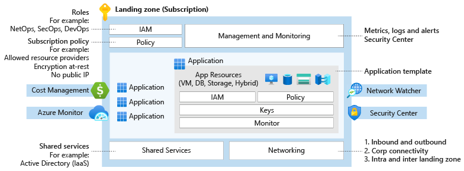

# Nyttige definisjoner og terminologi

## Landingssoner

Landingssoner i Azure består av abonnement (Subscriptions) konfigurert på en skalerbar måte og som samtidig ivaretar sikkerhet og tilhørende tjenester som nettverk og identitet.

Landingssoner muliggjør migrering, modernisering og innovasjon i stor-skala i Azure - samtidig som man kan rapportere på compliance (eller etablerte styringsregler man har satt for sin organisasjon).

Landingssonene som etableres tar høyde for alle plattformressurser som er nødvendig for å understøtte en bedrifts applikasjons-portefølje og differensierer ikke mellom infrastruktur som tjeneste (IaaS) og plattform som en tjeneste (PaaS).

Generelt kan vi se på oppbyggingen av en landingssone slik:

En målarkitektur for offentlig sektor må ta høyde for både on-prem (/edge) og allmenn sky samt styringgsett som understøtter dette holistisk.

## Tilgjengelighet (SLA)

- Høy tilgjengelighet (E.g - Konsumenttjeneste)
99.99 eller 99.95% oppetid. Noe nedetid (minutter) per år aksetabelt. Redundante server(e) og lagringskopier - men ikke på tvers av datasentere.

- Meget høy tilgjengelighet (e.g. pasientsystem)
99.99% eller høyere. Redundante servere og kopier av data på tvers av datasentere (med mer enn 10 km avstand).

- Unntakssituasjon (Disaster scenario)
En hel region går ned og blir utilgjengelig.

- Fullstendig suverenitet/autonomitet (autonomity/soveriginity)
Skyleverandør går konkurs, Norge mister all kommunikasjon med omverden, systemer som må fungere uavhengig av skyleverandør.

