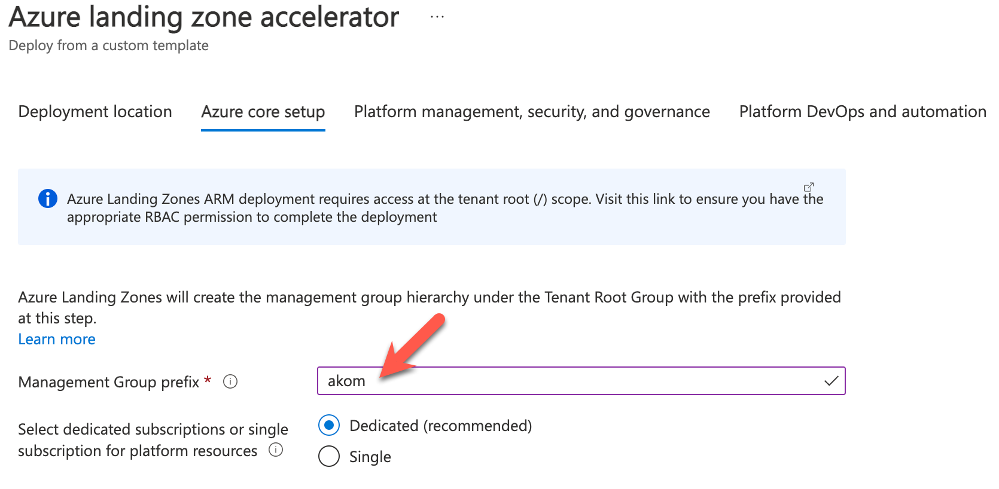

# Implementasjon

Når det kommer til praktisk implementasjon er det flere metoder å gjøre dette på, selv om man benytter seg av et eksisterende rammeverk som Cloud Adoption Framework Enterprise-scale (Hub-Spoke eller virtual WAN). En oversikt over mulige implementasjonsvalg er tilgjengelig [her](https://docs.microsoft.com/en-us/azure/cloud-adoption-framework/ready/landing-zone/implementation-options#implementation-options).

I den initielle referanse implementasjonen for kommunal sektor ser man for seg Enterprise Scale  implementasjonen benyttes som et fundament. Denne setter opp en rekke basis funksjonalitet for skyplattformen og inkluderer en rekke regler (policies) som man kan velge å ta i bruk og som forhåndskonfigureres basert på valg man gjør ved første gangsoppsett. 

**NB:** Det er viktig å nevne at dette kun er en mal, og man må ha en styring/forvaltningsgruppe som jobber med kravene og plattformen med fullstendig målbilde for sin kommune. Regelsett bør også forvaltes sentralt på sikt.

Referanseimplementasjonen tilgjengeliggjør en rekke regler - men setter relativt liten føring på hvilke regler (policies) som er aktive og dette bør videreutvikles når plattform modnes og over tid. Det er fult mulig å starte enkelt og utvide og tilpasse underveis. Nettverkdesign bør tenkes godt igjennom før man begynner noen fullskala utrulling og integrering, siden det er vanskeligere å endre på i etterkant enn styreregler. 

For å også konkretisere norske forhold er det også laget eksempel på hvordan slike regler kan lages/utvikles og deployes på toppen - for å imøtekomme norske forhold og anbefalinger (som eks. NSM sine grunnprinsipper).

## Tilpasning for kommunal sektor

Vurder følgende tilpasninger for kommunal sektor:

- Seperat Azure AD tenant for forvaltning ("forvaltningsenhet/forvaltningsorgan")
- Begrens tilgang til forvaltningsenhet/forvaltningsorgan (PIM og conditional access for brukere)
- Etabler styring og forvaltningsgruppe for skyplattform for å understøtte behov i kommune (cloud center of excellence)
    - Husk: Skyplattformen er levende og skal forvaltes, dokumenteres og videreutvikles og tilbys til andre enheter.
    - Levende dokumentasjon av plattform (wiki eller lignende)
    - Vurder DevOps-implementering for plattform (Infrastruktur og policies as code).
- Benytt og deploy Enterprise Scale i Azure AD Tenant til forvaltningsenhet som utgangspunkt. 
- Opprett delte Azure tjenester, Active Directory, nettverk  i Azure Subscription(s) tilknyttet forvaltningsenhet som kan benyttes av andre kommunale enheter
- Seperat Azure AD tenant - for hver kommunal enhet (e.g. Skole/Barnehage/mm) som krever det (e.g. av innsyn), har eksisterende SaaS tjenester (e.g M365/Teams/mm), egne administrative grenser, lisensavtaler med partnere/Microsoft direkte mm.     

- For kommunale enheter som har behov for egne Azure tjenester, har eksisterende lisensieringsavtaler eller Azure tjenester, vurder hvordan disse integreres med sentralt forvaltningsorgan.
    - Må fakturering skje direkte mellom leverandør og kommunal enhet (eller kan dette flyttes til forvaltningsenhet - sammen med tjenester?)
    - Skal tjenestene integreres med sentrale tjenester fra forvaltningsorgan (eks. Vnet peering / IAM)
    - Skal tjenestene inn under sentral forvaltning? Forvaltes gjennom Azure Lighthouse fra Azure AD til forvaltningsenhet
- Etablere IAM og B2B for forvaltning av kommunale enheter med seperate Azure AD Tenants (hvor det er behov for høyere tilgangsnivå, eks. Global Admin/Lisens administratorer mm.). Implementer PIM for disse rollene.
- Etablere B2B trust mellom tenants innad i kommune hvor informasjon skal deles
- Tilknytting av tjenester mellom forvaltningsenhet og fylkeskommune

*Eksempel på avtaleforhold, tenants og forvaltningsenhet/organ i kommunal sektor - merk avtaleforhold til Microsoft/Cloud provider kan være flere og bør kartlegges/gås opp*. 

Noen prinsipper lagt til grunn:
 - Enheter innad i en kommune må kunne dele tjenester
 - Enkel oppkobling av utstyr til delte tjenester (nettverk - Site-to-site, Point-to-site)
 - Sentral forvaltning og enkelt kunne legge opp nye tjenester til ansatte og innbyggere
 - Mulighet for å slå sammen eller splitte opp kommuner.
 - Skoler/Barnehager/andre kommunale enheter - har allerede eksisterende Azure AD tenants / eller må være splittet ut i seperat tenant (av lisensiering/lovmessige eller sikkerhetsmessige grunner)
 - Standardisering og modernisering av plattform
 - Mulighet for å samarbeide og dele tjenester med kommuner/fylkeskommune og raskere komme opp med nye tjenestetilbud til innbyggere på tvers.

## Forhåndskrav:

- 1 Azure AD tenant (forvaltningsenhet)
- 1 Azure AD tenant eller fler (for kommune/enheter innad i kommune)
- 1 eller flere Azure abonnementer
    - Ett enkelt kan benyttes, men anbefales kun for test & proof-of-concepts. Se [Use a single subscription](https://docs.microsoft.com/en-us/azure/cloud-adoption-framework/antipatterns/migrate-antipatterns#antipattern-use-a-single-subscription) for mer info. For produksjons-oppsett anbefales minumum 4: Connectivity, Identity, Management og Landing Zone.
- Rettigheter
    - Global Administrator i Azure AD
    - Owner på Root Management Group (/)

## Azure landingssone aksellerator

Trykk på knappen over og autentiser deg mot Azure-miljøet du ønsker å provisjonere ressurser til.

Velg region for utrullingen, typisk "Norway East" for norske kunder:

Gå til fanen "*Azure core setup*" og angi et prefix (maks 10 tegn) som vil benyttes på Azure Policy og andre ressurser som provisjoneres av malverket:

Gå til fanen "*Azure Platform management, security, and governance*".

Angi om du ønsker å aktivere overvåking:

Angi hvilket abonnement som skal benyttes for felles administrasjons-ressurser ("*Management*") og hak av for de løsningene du ønsker å aktivere:

Tilsvarende for sikkerhets-løsninger i Microsoft Defender for Cloud:

NB: Dette er tjenester som potensielt kan medføre betydelige kostnader, spesielt om de aktiveres i eksisterende miljø.

Angi en eller flere e-post adresser i feltet "*Microsoft Defender for Cloud Email Contact*":

Utrulling av kontinuerlig integrasjons- og utrullings pipelines er valgfritt og kommer an på organisasjonens strategi og modenhet rundt infrastruktur som kode:

Gå til fanen "*Network topology and  connectivity.*"
I referanse-utrullingen for kommune-sektoren velges "*Virtual WAN (Microsoft managed)*" som nettverkstopologi:

I valgene som blir tilgjengelig etter å ha valgt "*Virtual WAN (Microsoft managed)*" i forrige steg gjøres følgende tilpasninger:
- **Subscription**: Velg abonnementet som skal være dedikert for nettverks-ressurser.
- **Address space**: Angi CIDR som vil benyttes i hub (brukes primært for sentral routing)
- **Region for the first networking hub**: Norway East
- **Deploy VPN Gateway**: Yes (alternativt ExpressRoute Gateway dersom dette er satt opp, men for initielle oppsett og test-miljøer er VPN Gateway tilstrekkelig).
- **Enable Azure Firewall as a DNS Proxy**: Yes (muliggjør videresendte navneoppslag fra interne DNS servere for private endepunkter i Azure)

Gå til fanen "*Identity*" og velg abonnementet som skal være dedikert for identitets-ressurser:

La alle anbefalte innstillinger stå:

Trykk "*Next: Landing Zone configuration*".

Velg abonnementer som skal være dedikert for hybride og online landingssoner:

La anbefalte innstillinger være aktivert ift hvilke policiyer som blir aktivert for de valgte landingssone abonnementene:

Trykk *Review and create* etterfulgt av *Create* for å starte provisjoneringen.

## Etablering av hybrid oppsett

Etter provisjonering av ressurser i Azure er det noe steg som må utføres i lokalt miljø for å etablere forbindelse og fullføre det hybride oppsettet:

- Etablere VPN tunnell mellom Azure Virtual WAN og lokalt nettverk. Se [dokumentasjon]() for detaljer.
- Etablere site for nettverk i Azure i Active Directory Sites & Services
- Melde inn domenekontrollere i Azure (plassert i Identity abonnementet) og promotere disse til domenekontrollere
- Konfigurere Azure Firewall regler for kommunikasjon mellom Azure nettverk og lokale nettverk

## Compliance - Policy initative for NSM sine grunnprinsipper

Som et eksempel - viser vi her hvordan man kan gjøre en mapping av NSM sine grunnprinsipper, basert på ISO standarden og Azure policies og deploye dette for å få laget en tilpasset compliance rapport for Norske forhold. Man kan se for seg at det videreutvikles flere policies og kontrollmekanismer basert på community dersom dette er nyttig. Gjennom Azure Arc kan man også gjøre policy og compliance rapportering på eksisterende infrastruktur. 

Eksempel på hvordan NSM sine grunnprisnsipper kan mappes og deployes er foreløpig dokumentert [her](https://github.com/stalejohnsen/NSM_GP-IKT_2_0_policyinitative). Dokumentasjon og mal vil bli overføret til dette dokumentet. 

