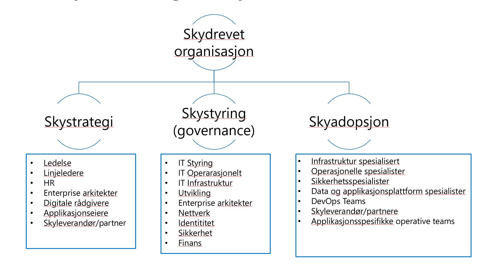
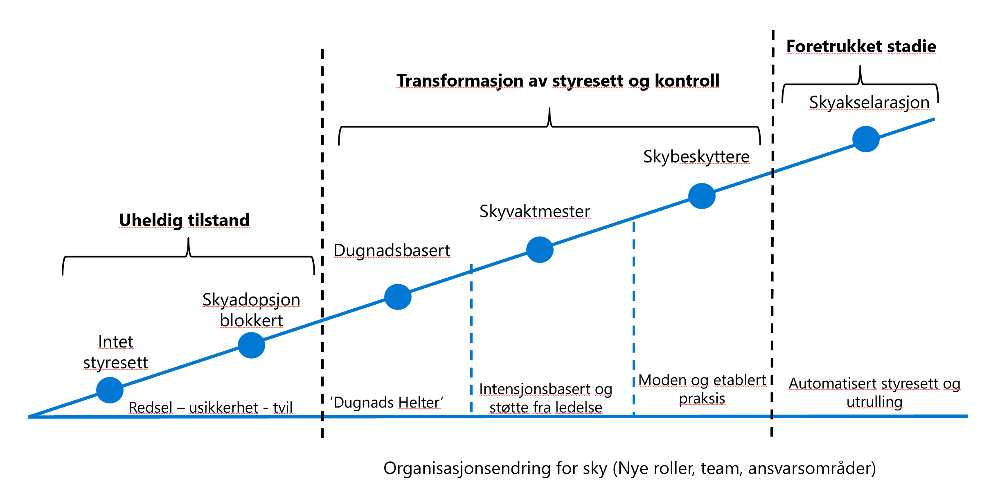

# Hvordan gjennomføre et skyprosjekt?

Skyadopsjon kan fort gå feil dersom man ikke har god forankring, gjør god planlegging og forventningsstyring samt legger ned et godt stykke arbeid i organisasjonstransformasjon.

Microsoft Cloud Adoption framework inneholder ca 1500 sider med god dokumentasjon på hvordan man skal gå frem for å tilvenne seg sky.

Vi prøver å forenkle noen av de viktigste prinsippene for å starte skyadopsjon her.

## Strategi og forankring

En god forankring for skyadopsjon begynner med en skystrategi som er forankret både hos toppledelsen og ansatte. Dersom man ikke har etablert en god skystrategi, så risikerer man at prosjektet mislykkes tidlig og blir blokkert eller nedprioritert.

En god skystrategi bør som et minimum inneholde følgende 4 punkter:

- Motivasjon for sky [Hvorfor skal vi til sky?]
- Forventninger og resultater [Hva kan vi forvente? Hva ønsker vi å oppnå]
- Finansielle betraktninger [Hva vil det koste, hva vil vi tjene, hva vil vi spare?]
- Tekniske vurderinger [Er det mulig? Hvordan kan det utføres teknisk? Hva må til?]

Det finnes en rekke fordeler med sky - men det er viktig å være forent og ha et felles mål på hvorfor man skal til sky og forventingsstyre alle ledd i organisasjonen. 

Utvikling av skystrategi ligger beskrevet i mer detalj [her](https://docs.microsoft.com/en-us/azure/cloud-adoption-framework/strategy/) (Engelsk)

## Organisasjon

Det er viktig at ikke punktet rundt organisering og organisasjon tas for gitt.. Skytransformasjon er noe nytt, setter nye premisser og krever nye funksjoner og roller innad i en organisasjon. 

En velykket skyadopsjon bør etablere et minimum sett av nye teams for å understøtte en rekke funksjoner som er påkrevd for sky. 

Disse teamene kan gjerne være virtuelle i starten - men bør utvikles og inngå mer formelt jo mer organisasjonen modnes. De som jobber i slike team må dediseres til å jobbe utelukkende med sky og ikke sitte med flere gamle roller. Erfaring tilsier at driftsoppgaver blir prioritert og fjerner fokus ifra sky.

## Mal for skydrevet organisasjon

Som et minimum - bør det etableres arbeidsgrupper for å definere strategi, styring og kontroll (styresett) og et eller flere arbeidsgrupper for adopsjon. 

I bildet over ser du eksempler på roller og funksjoner som kan inngå i disse teamene.

Etterhvert som organisasjonen modner seg så vil man konvergere mot en veletablert skyorganisasjon og flere kryssfunksjonelle teams med ulike skyroller bør inngå i et [CCoE](https://docs.microsoft.com/en-us/azure/cloud-adoption-framework/organize/cloud-center-of-excellence) (Cloud Center of Excellence).
Dette referes ofte til på norsk som et Kompetansesenter sky, og må etablieres i organisasjonen så tidlig som mulig, med korrekt forankring. En skyevangelist bør lede et Kompetansesenter sky, og motivere organisasjonen for skyreisen.

Etterhver som skytjenester ibruktages må skyen også driftes. Dette utføres ikke av Kompetansesenter Sky, men av et Driftsenter Sky. I oppstartfasen vil disse to teamene jobbe tett sammen, kanskje som ett team til og med, og etterhvert vil roller og ressurser fordeles mellom disse.

For mer informasjon om hvordan man kan organisere seg og ulike typer funksjoner i en skyorganisasjon - se [her](https://docs.microsoft.com/en-us/azure/cloud-adoption-framework/organize/).

***NB:*** Organisasjoner befinner seg på ulike stadier i en modenhetsprosess. Ofte vil mangel på styring og kontroll blokkere adopsjon. Vet du hvor dere er i forhold til organisasjon, modenhet og strategi? Har dere dugnadshelter som lager styresett? Har dere automatisert styresett og utrulling av funksjonalitet?

På [denne](https://docs.microsoft.com/en-gb/assessments/
) siden ligger en rekke spørreskjemaer du kan benytte for å finne ut hvor dere ligger ann i forhold til skyadopsjon. 

## Planlegging

En god planlegging bør omfatte minimum

- Hva har vi av IT-systemer og tjenester som skal supporteres, hvordan ser landskapet ut, hva skal til sky, hva bør vi erstatte, hva kan skrives om mm.
- Hvem inngår i ulike arbeidsgrupper for å jobbe med sky og hvordan setter vi det sammen
- Kompetanseplan og kompetansebehov. 
- Adopsjonsplan med tidsplanlegging og prosjektstyring.

Velg et prosjektverktøy som kan benyttes for å følge utviklingen av skyprosjektet og for å tilordne oppgaver og ansvar. 

[Her](https://docs.microsoft.com/en-us/azure/cloud-adoption-framework/plan/) ligger en rekke utfyllende dokumentasjon og erfaringer rundt å legge gode planer.  

## Klargjøring (Ready)

Før man kan begynne implementering og adopsjon, så designer man landingssoner som kan benyttes for de ulike applikasjonene man skal tilby på sin plattform.

Klargjøringsfasen kan deles inn i 4 faser:

- Operativ modell - finn den rette modellen man ønsker å ha på operasjonell modell i sky
- Design områder - En rekke områder man bør tenke igjennom og designe for. Viktig å skjønne og tegne hvordan man ser for seg avtaleforhold, AAD tenants, brukerhåndtering mm. for sin kommune (eller flere kommuner).
- Azure landingssoner - forstå ulike landingssoner og valg for å aksellere utrulling av landingssoner og applikasjoner. 
- Reisen til en referansearkitektur - valider hvor du er i forhold til implementering og hvilke valg du har for å flytte/migrere eller modernisere applikasjoner mot skyreisen.

## Migrering (Migrate)
Inneholder en rekke god dokumentasjon på hvordan du kan migrere ekisterende applikasjoner til sky, ulike scenarioer på flytting til sky og best practices når det gjelder flytting/migrering. 

***Husk:*** Migrering er ikke kun en teknisk jobb - husk at organisasjon, brukere og ansatte også vil påvirkes av skyreisen og kreve endringspraksis.

## Innovasjon (Innovate)
Hvordan kan sky hjelpe bedriften å innovere? Disse sidene under 'CAF' omhandler nettopp hvordan du kan begynne å ta i bruk sky for innovasjon, lage prototyper og teste ut mot 'publikum' og måle effekt. 

[Innovasjon starter med å løse et problem og definere 'business' verdi. Hva kan vi hjelpe innbyggere med? Hva oppnår vi med å løse følgende problem? Får vi nye muligheter? Hvilken motivasjon kan vi ha for å løse problemet?](https://docs.microsoft.com/en-us/azure/cloud-adoption-framework/innovate/business-value)

***Husk:*** Sky åpner for en rekke nye muligheter som tidligere var meget kostbart eller ikke mulig og man kan raskt komme i gang med å lage publikumstjenester, tilgjengeliggjøre data til innbygere, eller samle inn data. 

[Les mer om Digital Inventions her](https://docs.microsoft.com/en-us/azure/cloud-adoption-framework/innovate/considerations/invention)

## Sikkerhet (Secure)

Sikkerhet i en hver organisasjon må være en hovedprioritet. Dette inkluderer også forankring av forretning/organisasjon og må ikke kun sees på som en 'teknisk' jobb. 

[Sikkerhet i CAF omtales i meget god detalj her](https://docs.microsoft.com/en-us/azure/cloud-adoption-framework/secure/)

## Forvaltning (Manage)

## Styresett og kontroll (Govern)

\newpage
