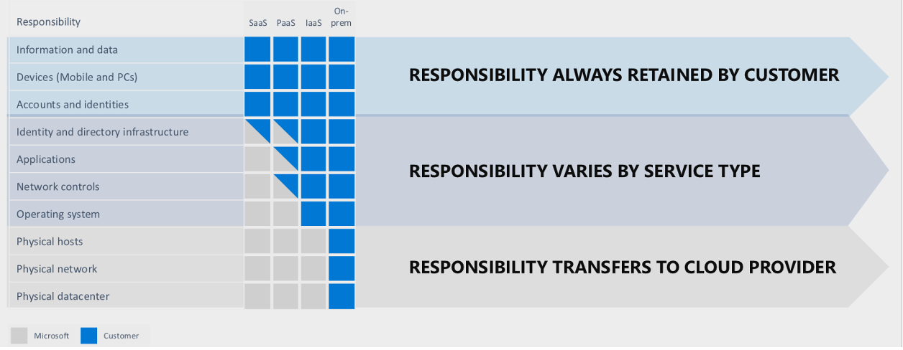
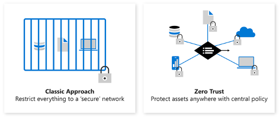
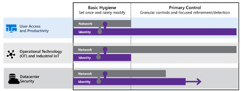
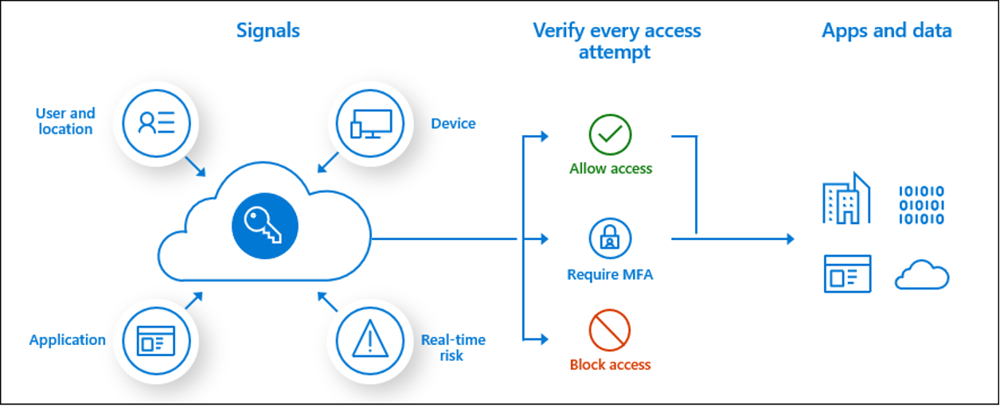

# Sikkerhet i skyen

Når det kommer til hvem som er ansvarlig for sikkerhet i et skymiljø er dette generelt sett et felles ansvar mellom kunde og leverandør, men det er ulike grenser for ulike tjenestemodeller:

For Software as a Service (SaaS)-tjenester slik som Office 365 hvor Microsoft hoster all underliggende infrastruktur har kunden «kun» ansvar for tilgangsstyring og data lagret inne i tjenestene. Infrastruktur rundt tjenestene slik som servere, nettverksinfrastruktur, høytilgjengelighet med mer håndteres av Microsoft.

Når det kommer til Azure er det flere tjeneste-modeller inne i bildet:
- **Infrastructure as a Service (IaaS)** – Lagring, nettverk og virtuelle maskiner – hvor kunden selv har ansvaret for elementer som vedlikehold av operativsystem, eksponering av tjenester mot internett med mer.
- **Platform as a Service (PaaS)** – Eksempelvis Azure SQL og lagringskontoer, hvor underliggende infrastruktur driftes og vedlikeholdes av Microsoft. Kunden konsumerer data-laget.

Microsoft har over flere år tilstrebet og anbefalt en «nulltillits-modell» (Zero Trust), hvor grunnprinsippene er:

- **Bekreft eksplisitt** – Valider alltid identitet, enheters helse og uregelmessige bruksmønstre
- **Benytt lavest privilegerte tilgang** – For å sikre både data og produktivitet, begrens brukertilganger ved hjelp av «Just in time access» (JIT), «Just enough access» (JEA) og risikobaserte adaptive tilgangspolicyer
- **Anta sikkerhetsbrudd** – Minimer spredningsradiusen ved innbrudd ved å segmentere tilgang etter nettverk, brukere, enheter og applikasjoner. Krypter alle sesjoner ende-til-ende. Benytt analyseverktøy for å oppdage trusler, få innsikt etter eventuelle innbrudd og for å forbedre forsvar.

Dette er en stor endring fra tradisjonelle tilnærminger:

Der hvor man tidligere satt fysisk på en arbeidsstasjon i det lokale nettverket benyttes i stor grad mobile enheter (laptoper, nettbrett, mobiler, med mer) og man kan arbeide fra hvor som helst.

Identitet har derfor blitt en ny viktig faktor for sikring, hvor bruk av multifaktor-autentisering og policy-basert styring har blitt essensielle virkemidler. Som en konsekvens av endrede bruksmønstre ser vi at identitet har blitt en sterkere sikkerhets-mekanisme enn nettverk når det gjelder tilgang til produktivitetsløsninger som e-post og andre samhandlingsløsninger:

Når det kommer til infrastruktur har vi fremdeles behov for kontroll på nettverksnivå, men ved å følge Zero Trust prinsippene bør disse være mer segmenterte enn tidligere. Mikrosegmentering hvor det opprettes dedikerte nettverkssoner for hver enkelt applikasjon/løsning er derfor en anbefalt tilnærming.

En god del virksomheter har i prinsippet en slik tilnærming for lokal infrastruktur i dag, hvor dedikerte nettverkssegmenter er opprettet for IoT-enheter og ulike andre formål, slik som dedikerte subnet for fagapplikasjoner med ulike krav til sikkerhet.

Det anbefales at samme tilnærming videreføres i Azure, og at det etableres en sentral tilgangskontroll via en brannmur og/eller nettverkssikkerhetsgrupper (NSG/Network Security Groups). NSG`er – som forenklet kan ses på som aksesslister assignet til virtuelle nettverkskort - skalerer til et visst punkt, hvor det typisk blir nødvendig med en sentral styringsmekanisme for enklere administrasjon og oversikt.

Azure Firewall er en PaaS-tjeneste for nettopp dette formålet, som på generell basis anbefales fremfor 3. parts appliance-løsninger for lavest TCO (Total Cost of Ownership).

## Verktøy

For å understøtte Zero Trust-prinsippene har Microsoft en hel del verktøy og tjenester som er relevante i kontekst av sikkerhet i Azure:

•	**Defender for Cloud Apps** – En såkalt ”Cloud Access Security Broker” som er primært fokusert på SaaS-tjenester for å få en total oversikt over tjenester i bruk (avdekke eventuelle «Shadow IT»-tjenester). I tillegg til tett integrasjon med Microsoft 365 støttes connectorer mot en hel del 3. parts skytjenester. Unormal aktivitet på tvers av skytjenester er et scenario som kan oppdages og varsles på med denne tjenesten.

•	**Azure AD Identity Protection** – Basert på en hel del signaler slik som lokasjon, IP-adresser og andre elementer vil denne tjenesten kunne avdekke potensielle farer og klassifisere risiko ved brukerpålogginger (Lav, Middels, Høy risiko) i Azure AD. Eksempel på et scenario er atypisk reise, hvor en bruker logger på fra 2 forskjellige land eller verdensdeler med kort mellomrom. Da vil denne tjenesten kunne konfigureres til å varsle og hvis ønskelig blokkere brukerkontoen, slik at man har automatisk blokkering for scenarier hvor en brukerkonto er kompromittert.

•	**Defender for Identity** – En skytjeneste som samler informasjon og signaler fra on-prem Active Directory i form av sensorer/agenter på domenekontrollere. Tjenesten kan avdekke scenarier som «lateral movement», hvor en kompromittert konto benyttes for å logge seg på videre inn til andre servere eller klienter.

•	**Defender for Cloud** – En skytjeneste som kontinuerlig scanner tjenester i et Azure-abonnement for å gi et innblikk i sikkerhetskonfigurasjon og tilby anbefalinger for å øke sikkerheten. Det er flere under-tjenester som kan aktiveres som en del av denne tjenesten

 - Microsoft Defender for Servers
 - Microsoft Defender for Storage
 - Microsoft Defender for SQL
 - Microsoft Defender for Containers
 - Microsoft Defender for App Service
 - Microsoft Defender for Key Vault
 - Microsoft Defender for Resource Manager
 - Microsoft Defender for DNS
 - Microsoft Defender for open-source relational databases
 - Microsoft Defender for Azure Cosmos DB (Preview per Mars 2022)

Hver av disse undertjenestene har egne pris-modeller, eksempelvis Microsoft Defender for Servers har en sum per måned per server som modell – mens Defender for Resource Manager er priset basert på antall forespørsler som går gjennom Azure Resource Manager (API-tjenester hvor alle Azure management-operasjoner går gjennom).

Defender for Servers kan også benyttes på maskiner utenfor Azure, slik som servere i eget datasenter eller andre skyplattformer. Tjenesten inkluderer lisens for Defender for Endpoint, og gir følgende ekstra funksjonalitet:
  - Verktøy for scanning av sårbarheter i operativsystemet – her kan man velge mellom Microsoft`s egen «threat and vulnerability»-løsning og en sårbarhets-scanner fra Qualsys (en av de ledende leverandørene av sanntids identifisering av sårbarheter) som er lisensiert som en del av tjenesten.
  - Docker nedlåsing – Containere som kjører inne i virtuelle maskiner scannes og sammenlignes opp mot CIS (Center for Internet Security) sine Docker Benchmarks.
  - Fil-løs angrepsdetektering – Angrep hvor payloads ikke lagres på disk, men kun kjøres i minne og typisk persisteres inne i kompromitterte prosesser oppdages og alarmeres på.
  - Auditd alarmer (for Linux) – auditd er et subsystem på kernel-nivå som er ansvarlig for å overvåke kall til kernel. Defender for Servers detekterer unormal aktivitet slik som tvilsomme prosesser og innlasting av ukjent kernel-moduler.

•	**Defender for IoT** – tjeneste som ikke går under Defender for Cloud, men som også er en viktig komponent rundt skysikkerhet. Produktet ble lansert i Januar 2021 som et resultat av et oppkjøp («CyberX»), og er myntet på enheter som i motsetning til laptoper og telefoner ikke støtter installasjon av agenter eller annen management-software. De går dermed på mange måter under radaren når det kommer til overvåking og synlighet overfor sikkerhetsansvarlige. Uten en slik synlighet er det veldig utfordrende å oppdage om enheter er kompromitterte. En rekke enheter for industrielle kontrollsystemer tilknyttet områder som elektrisitet, vann, transport, datasentre, smarte bygninger, farmasi, olje og gass samt andre kritiske løsninger går inn i denne kategorien enheter. Defender for IoT er agentløs, og har innebygd kjennskap til en stor mengde industrielle protokoller og benytter seg av utstrakt bruk av Machine Learning og automatiserte deteksjoner på samme måte som flere av Microsoft`s andre skysikkerhetsløsninger. For å benytte denne løsningen kan en fysisk eller virtuell appliance settes opp for mottak av kopi av nettverkstrafikk fra switcher (vha SPAN port eller TAP), slik at tjenesten ikke påvirker IoT-enhetene som overvåkes på noe vis. I denne videoen fra Microsoft Ignite spilt inn kort tid etter oppkjøpet av CyberX vises integrasjon med Microsoft Sentinel og hvordan alarmer for eksempelvis uautorisert PLS-programmering fanges opp.

•	**Microsoft Sentinel** – En SIEM (security information and event manager) platform basert på stor grad av innebygd AI (Artifical Intelligence) for analysering av store datamengder.

Selv om dette er en skytjeneste kan den også samle inn data fra hvor som helst, så for eksempel logger fra on-prem nettverksutstyr kan streames ut via syslog.

Det er over tid bygget opp et stort community rundt Sentinel, og man kan finne en rekke spørringer og såkalte playbooks både fra Microsoft og andre på steder som GitHub. Playbooks gjør det mulig å blant annet foreta automatiske handlinger basert på hendelser som oppstår, for eksempel å blokkere en bruker, sende varsel til en Teams-kanal eller å opprette en sak i et brukerstøttesystem slik som ServiceNow eller andre.

Det finnes også en hel del connectorer mot for eksempel Azure AD, aktivitetslogger i Azure, Defender for Cloud, Defender for Identity, Checkpoint, Cisco, AWS, Google med mange flere for innsamling av data. Sentinel vil dermed kunne være et sentralt nav for deteksjon og håndtering fra mange (potensielt alle) kilder som benyttes i en organisasjon.

•	**Azure Arc for Servers** – Dette er en tjeneste som gjør det mulig å prosjektere servere som kjører utenfor Azure inn som objekter i Azure. Dette muliggjør bruk av tagging slik at man har ett sted å samle metadata om servere. En annen funksjon som er kjernen i det denne tjenesten muliggjør er installasjon av [VM extensions](https://docs.microsoft.com/en-us/azure/azure-arc/servers/manage-vm-extensions), slik som Azure Monitor Agent og Defender for Servers. Andre eksempler som kan trekkes frem er Azure Automation Hybrid Runbook worker extension, som gjør det mulig å kjøre PowerShell og Python runbooks på on-prem servere. En annen er Auzre Key Vault Certificate sync, som gjør det mulig å synkronisere et sertifikat fra et sentralt Key Vault ut mot flere servere.

## Conditional Access

Betinget tilgang (conditional access) er en funksjon i Azure Active Directory som gjør det mulig å definere policyer som forenklet sagt er et sett med «if then»-klausuler.

En rekke signaler samles og evalueres. Policyer kan defineres å gjelde all autentisering mot alle applikasjoner i Azure AD, eller granuleres per applikasjon. Mange har allerede definert slike policyer for tilganger til Microsoft 365.

Signaler som ofte brukes:
•	Gruppemedlemskap – for å begrense en policy eller tilgang til en bestemt gruppe brukere
•	IP lokasjonsinformasjon – IP-ranger som anses som trygge slik som bedriftens offisielle IP-adresse ut mot internett samt geografisk tilhørighet til offisielle adresser brukere logger på fra
•	Enheter – type operativsystem og informasjon om enheten er en del av Azure AD og/eller Active Directory
•	Applikasjon – spesifikke applikasjoner kan trigge dedikerte policyer
•	Sanntids risikoanalyse – Integrasjon med Azure AD Identity Protection for scenarier som atypiske reiser (pålogging fra 2 land med kort tids mellomrom)
•	Microsoft Defender for Cloud Apps – Muliggjør ytterligere innsikt i brukeres pålogginger og aktiviter

Basert på signaler kan ulike avgjørelser defineres:
•	Blokkere tilgang (den mest restriktive avgjørelsen)
•	Tillate tilgang
o	Betingelser hvor en eller flere av følgende påkreves
	Multifaktor autentisering
	Enhet må være markert som trygg (oppdaterte antivirus/malware-definisjoner som et eksempel)
	Enhet må være hybrid Azure AD joined
	Klient-applikasjonen som aksesseres må være forhåndsgodkjent

Ønsker man å begrense tilgang til administrasjonsverktøyene i Azure er det mulig å lage en policy som vil legge restriksjoner på tilgang via:
-	Azure portal
-	Azure Resource Manager provider
-	Classic Service Management APIs
-	Azure PowerShell
-	Visual Studio Subscriptions administrator portal
-	Azure DevOps
-	Azure Data Factory portal

Selv om en standard bruker ikke har noen tilganger i Azure vil man kunne logge på portal.azure.com, men ikke se noen abonnementer eller ressurser. Dette vil blokkeres for vanlige brukere ved innføring av en slik policy.

## Nettverk

### Private endepunkter

Et privat endepunkt i Azure er et virtuelt nettverkskort med en privat IP adresse fra et virtuelt nettverk man selv har opprettet, og som dermed kan tilgjengelig gjøres fra interne on-prem nettverk via ExpressRoute eller VPN. Dette nettverkskortet kobles til Azure Private Link for å bringe PaaS-tjenester inn i det interne nettverket.

Med dette oppnås en høyere grad av sikkerhet, siden ekstern tilgang for tjenester kan deaktiveres.

Selv om tjenester står eksponert direkte mot internett via offisielle IP-adresser betyr det ikke nødvendigvis at de er usikre. For eksempel et Key Vault kan likevel være sikret på identitetslaget i form av multifaktor-autentisering, på samme måte som en SaaS-tjenesten slik som Exchange Online.
En fordel med å bruke private endepunkter er bedre beskyttelse mot data-lekkasjer grunnet feil konfigurasjon av tilganger. Eksempelvis vil en mappe i en lagringskonto være åpent tilgjengelig via internett dersom rettighetene på mappen ved en feil er satt til anonym tilgang.
En annen fordel er at PaaS-tjenester som er konfigurert med private endepunkter kan aksesseres via ExpressRoute, og dermed unngå å måtte traversere internett. Det vil gi lavere latency, siden trafikken går via den private kommunikasjonslinjen fra ExpressRoute ISP`en.
