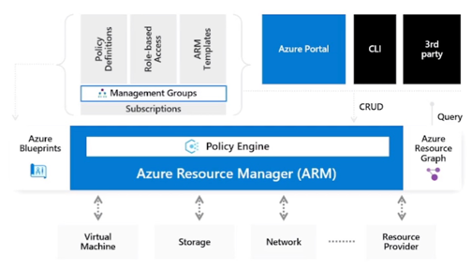
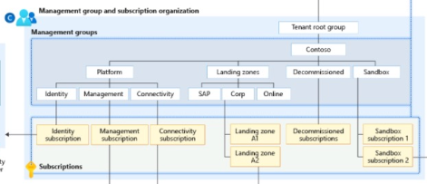
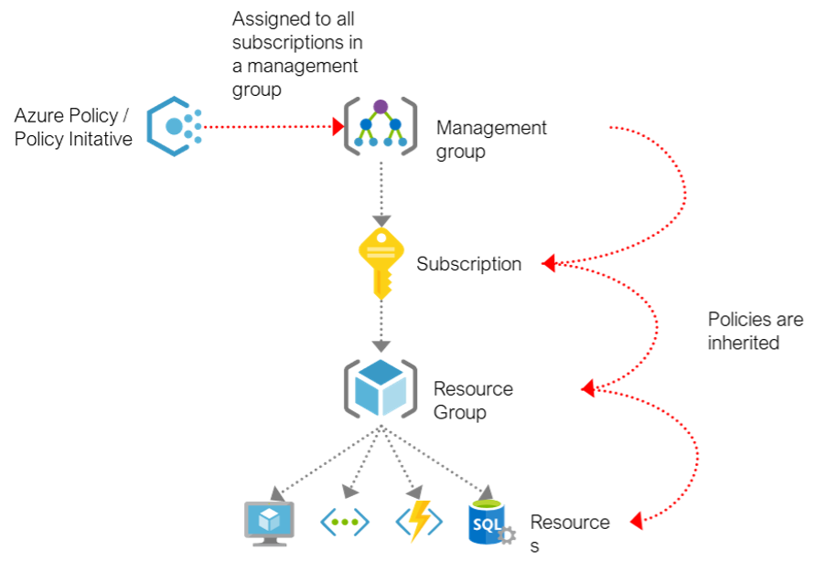
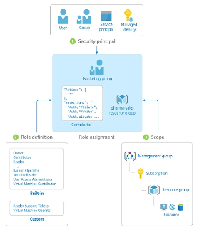
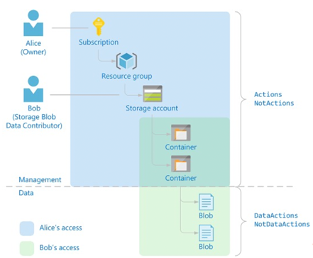

 # Operasjonsmodeller

Det eksisterer ulike operasjonsmodeller for drift av sky-tjenester:
- Desentralisert drift (autonome team): Samme team tar ansvar for alt, dvs sikkerhet, backup, nettverk, servere eller evt andre tjenester for en bestemt applikasjon.
- Sentralisert drift: Ligner på det man er vant til fra tradisjonelle on-prem miljøer hvor samme team tar ansvar for sentral infrastruktur. Nye løsninger må tilpasses arkitektur og drift på løsningen som er lagt til grunn, for eksempel delt infrastruktur for lagring, nettverk og virtuelle maskiner.
- Enterprise operations/storskala drift: Sentralt team tar mer ansvar ende til ende, også på lag som overvåking på applikasjonsnivå.
- Distribuert drift: En kombinasjon av de 3 modellene. For eksempel I forbindelse med selskaper som slår seg sammen, eller et selskap fordelt over flere land med lokale IT-avdelinger.

Et så kalt Cloud Center of Excellence – eller skyplattformteam – understøtter typisk enterprise operations modellen.

Dette er et viktig team å ha på plass når man skal gå fra tradisjonell drift over på en mer moderne DevOps-tankegang hvor man har som mål å gjøre DevOps-team mer i stand til å selv provisjonere og drifte sine løsninger.

En markant forskjell er at IT blir mer en broker som hjelper de andre teamene med å bli gode på det skal gjøre.

Det er nettopp her styresett kommer inn i bildet, hvor skyplattformteamet trenger å ha kontroll på mange elementer på plattform nivå – slik som kostnadskontroll, sikkerhet, nettverk og så videre.

For å hjelpe kunder med disse elementene har Microsoft et rammeverk som kontinuerlig forbedres basert på erfaringer fra kunder i alle slags størrelser: Cloud Adoption Framework. Dette rammeverket benyttes av Microsoft og partnere når de arbeider og veileder kunder i bygging av en sikker grunnmur.

Rammeverket er opiniated med en hel del referanse-arkitekturer som enten kan brukes som de er eller fungere som inspirasjon og veiledere.

Enterprise Scale landing zones er en slik referanse-implementasjon som understøtter operasjonsmodellen Enterprise operations.

## Policy-styrt administrasjon

Et av de grunnleggende prinsippene i CAF (Cloud Adoption Framework) er muligheten for å definere policyer for å sikre miljøet iht definert styresett.

Uansett verktøy vil alle operasjoner som gjøres mot management-planet i Azure gå via Azure Resource Manager (ARM), hvor policy-motoren er implementert.

Denne sørger for sanntids evaluering av definerte policyer, hvor man eksempelvis kan tillate bruk av spesifikke Azure-regioner, blokkere bruk av virtuelle maskiner med offentlige IP-adresser, provisjonere overvåkings-agenter og en hel del mer.
Fra et sikkerhetsperspektiv får man dermed stor grad av kontroll, samtidig som applikasjons/systemeiere og leverandører kan få en stor grad av frihet til å provisjonere tjenester slik det passer løsningen som skal bygges – eksempelvis bruk av GitHub Actions for kontinuerlige leveranser og utrullinger, og bruk av Terraform for provisjonering av infrastrukturen som understøtter løsningen.

## Abonnementer og administrasjonsgrupper

Demokratisering i Azure kan gjøres med abonnementer. Et abonnement kan forenklet ses på som en minisky, som er koblet til et sentralt styresett.

Selv om det teoretisk sett er mulig å sette opp all Azure-infrastruktur i et og samme abonnement er det i CAF lagt opp til en modell hvor et sett med dedikerte abonnementer for plattform-tjenester settes opp – samt dedikerte abonnementer for ulike landingssoner.
Det er definert et sett med [antimønstre](/Antimonstre.md) i CAF, hvor det å benytte et og samme abonnement for alle tjenester er et antimønster. Begrunnelsen er at det ofte medfører dårligere styresett-implementasjoner og sub-optimale design, og at det er større sjanse for å møte på begrensninger slik som ressurs-kvoter. Kvoter i Azure er definert på abonnements-nivå, hvor man har et sett med virtuelle CPUer per region som et eksempel. Typisk standard-verdi for dette eksempelet er 350 vCPUer i Norway East per abonnement, noe som fort kan brukes opp dersom et sett med virtuelle maskiner som har for eksempel 8 eller 16 vCPU`er provisjoneres. Det er mulig å søke om utvidelse av kvoter, men dette er typisk enklere å håndtere om det er egne abonnementer for hver landingssone.

Administrasjonsgrupper er en logisk gruppering av abonnementer, som gjør det enklere å kontrollere både policyer og tilganger på overordnede nivåer.

Referanse-arktitekturen for Enterprise Scale i Cloud Adoption Framework har et sett med administrasjonsgrupper for plattform-abonnementer, landingssoner samt dekommisjonerte- og sandkasse-abonnementer.

Policyer som provisjonerer standard-ressurser slik som et Azure Key Vault per abonnement kan da tildeles på et høyere nivå og vil da arves nedover i hierarkiet.

## Tilgangsstyring

Tilgangsstyring i Azure er knyttet opp mot Azure Active Directory (AD). Ett Azure abonnement kan være tilknyttet èn Azure AD tenant.

I den tilknyttede tenanten ligger brukere, grupper og tjenestekontoer (service principals) som kan tildeles rollebaserte tilganger i Azure.

Tilganger på management gruppe og abonnements-nivå delegeres typisk kun til plattform-teamet som forvalter miljøet, mens tekniske ressurser og systemeier typisk gis tilganger på ressursgruppe nivå. Eksempelvis er det en vanlig praksis å ha dedikerte ressursgrupper for de ulike miljøene en applikasjon typisk har (slik som produksjon, qa & dev), med tilhørende Azure AD grupper for ulike nivåer av tilganger. En mulighet mange tilstreber er at tilgang til produksjon begrenses til lese-rettigheter, mens ytterligere rettigheter må godkjennes.

Et viktig aspekt når det kommer til rettigheter for Azure-ressurser er forskjellen på management- og data-plane. I følgende eksempel hvor Alice er eier på abonnements-nivå har hun det høyeste rettighetsnivå man kan ha på management-planet:

Likevel har hun ingen tilganger på Data-planet, det vil i dette eksempelet (en lagringskonto) si at hun ikke kan lese eller skrive innhold. For å gjøre det er det dedikerte roller per tjeneste som gir tilgang. I eksempelet over har Bob rollen Storage Blob Data Contributor, og har dermed full tilgang til å lese og skrive data – selv om han ikke har tilgang på management-planet.

Et mer klassisk eksempel er virtuelle maskiner, hvor man selv om man har fulle rettigheter på management planet ikke har rettigheter inne i operativsystemet på en virtuell maskin. Er maskinen Azure AD joined kan Azure Role Based Access Control benyttes for å delegere tilganger på data-planet. I motsatt fall må dette gjøres via andre mekanismer som lokale brukere og grupper eller et tradisjonelt Active Directory.

I tillegg til å benytte Azure AD grupper for å delegere tilganger – enten det er på management eller data planet – anbefales bruk av Azure AD Privileged Identity Management (Azure AD PIM). Denne tjenesten muliggjør en «just-in-time»-tilnærming, hvor man har rettigheter til å elevere seg til en bestemt tilgang. Når rettigheten brukes er det typisk påtvunget bruk av multifaktor-autentisering, og tilgangen utløper etter en viss periode (typisk 8 timer).

I tillegg til Azure AD PIM kan en tjeneste som heter Azure AD Identity Governance være verdt å vurdere. Denne gir følgende funksjonalitet:
•	Administrasjon og styresett rundt gruppemedlemskap
•	Godkjennings- og ettersynsprosess
•	Administrasjon av gjestebrukere
•	Selvbetjening: myaccess.microsoft.com

Siden man med denne løsningen får stor grad av selvbetjeningsmuligheter vil det typisk bli vesentlig færre brukerstøttesaker. Man får også en bedre oversikt over hvem som eier Azure AD grupper, og sikrer jevnlig ettersyn av hvem som er medlemmer i gruppene og dermed har tilgang til i denne sammenhengen Azure-tjenester. Et eksempel kan være konsulent-brukere som er innleid for en viss periode, hvor avvikling av bruker eller gruppemedlemskap potensielt kan bli glemt dersom det ikke er noen rutiner på plass.

Med Azure AD Entitlement management funksjonen som ligger i Azure AD Identity Governance vil man kunne delegere dette ansvaret til gruppeiere når det kommer til tilgangsstyring.

## Tagging

Tagger er metadata på abonnementer, ressursgrupper og ressurser som gir stor fleksibilitet ift å identifisere ting som bruksområder, tjenesteeiere, kostnadssentre med mer. Det er sterkt anbefalt å innføre et regime rundt hvilke tagger som er påkrevd for å kunne opprette ressurser.
