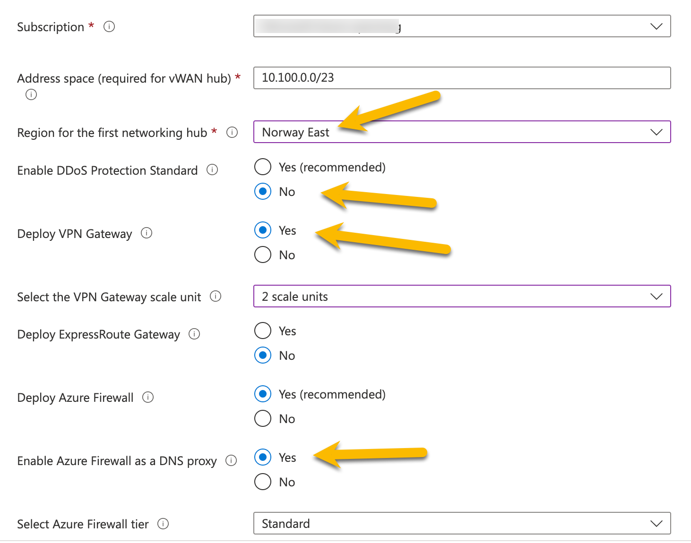
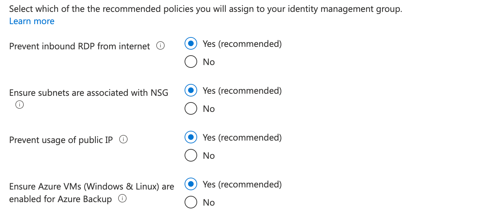
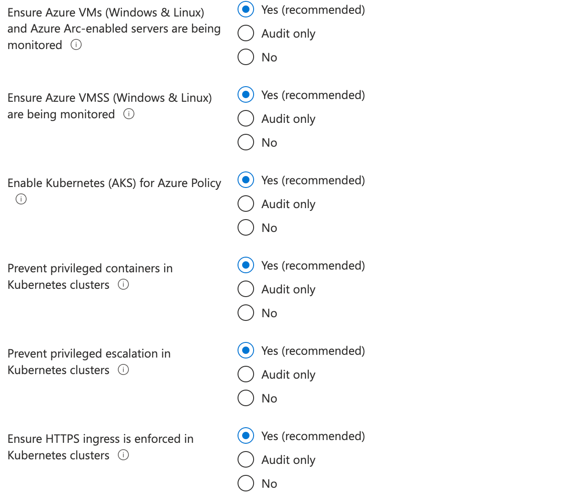
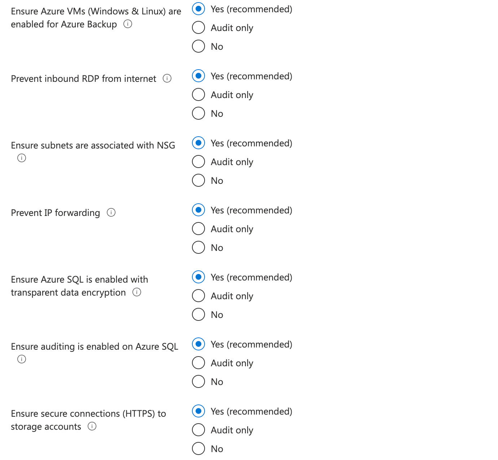

# Implementasjon

Når det kommer til praktisk implementasjon er det flere metoder å gjøre dette på, selv om man skal benytte et eksisterende rammeverk som Cloud Adoption Framework Enterprise-scale.

En oversikt er tilgjengelig [her](https://docs.microsoft.com/en-us/azure/cloud-adoption-framework/ready/landing-zone/implementation-options#implementation-options).

I den initielle referanse-implementasjonen for kommunal sektor er bruk av Azure Resource Manager templates benyttet, primært for å kunne benytte Azure portalen som frontend.

## Forhåndskrav:

- 1 Azure AD tenant
- 1 eller flere Azure abonnementer
    - Ett enkelt kan benyttes, men anbefales kun for test & proof-of-concepts. Se [Use a single subscription](https://docs.microsoft.com/en-us/azure/cloud-adoption-framework/antipatterns/migrate-antipatterns#antipattern-use-a-single-subscription) for mer info. For produksjons-oppsett anbefales minumum 4: Connectivity, Identity, Management og Landing Zone.
- Rettigheter
    - Global Administrator i Azure AD
    - Owner på Root Management Group (/)

## Azure landingssone aksellerator

Trykk på knappen over og autentiser deg mot Azure-miljøet du ønsker å provisjonere ressurser til.

Velg region for utrullingen, typisk "Norway East" for norske kunder:

Gå til fanen "*Azure core setup*" og angi et prefix (maks 10 tegn) som vil benyttes på Azure Policy og andre ressurser som provisjoneres av malverket:

Gå til fanen "*Azure Platform management, security, and governance*".

Angi om du ønsker å aktivere overvåking:

Angi hvilket abonnement som skal benyttes for felles administrasjons-ressurser ("*Management*") og hak av for de løsningene du ønsker å aktivere:

Tilsvarende for sikkerhets-løsninger i Microsoft Defender for Cloud:

NB: Dette er tjenester som potensielt kan medføre betydelige kostnader, spesielt om de aktiveres i eksisterende miljø.

Angi en eller flere e-post adresser i feltet "*Microsoft Defender for Cloud Email Contact*":

Utrulling av kontinuerlig integrasjons- og utrullings pipelines er valgfritt og kommer an på organisasjonens strategi og modenhet rundt infrastruktur som kode:

Gå til fanen "*Network topology and  connectivity.*"
I referanse-utrullingen for kommune-sektoren velges "*Virtual WAN (Microsoft managed)*" som nettverkstopologi:

I valgene som blir tilgjengelig etter å ha valgt "*Virtual WAN (Microsoft managed)*" i forrige steg gjøres følgende tilpasninger:
- **Subscription**: Velg abonnementet som skal være dedikert for nettverks-ressurser.
- **Address space**: Angi CIDR som vil benyttes i hub (brukes primært for sentral routing)
- **Region for the first networking hub**: Norway East
- **Deploy VPN Gateway**: Yes (alternativt ExpressRoute Gateway dersom dette er satt opp, men for initielle oppsett og test-miljøer er VPN Gateway tilstrekkelig).
- **Enable Azure Firewall as a DNS Proxy**: Yes (muliggjør videresendte navneoppslag fra interne DNS servere for private endepunkter i Azure)

Gå til fanen "*Identity*" og velg abonnementet som skal være dedikert for identitets-ressurser:

La alle anbefalte innstillinger stå:

Trykk "*Next: Landing Zone configuration*".

Velg abonnementer som skal være dedikert for hybride og online landingssoner:

La anbefalte innstillinger være aktivert ift hvilke policiyer som blir aktivert for de valgte landingssone abonnementene:

Trykk *Review and create* etterfulgt av *Create* for å starte provisjoneringen.

## Etablering av hybrid oppsett

Etter provisjonering av ressurser i Azure er det noe steg som må utføres i lokalt miljø for å etablere forbindelse og fullføre det hybride oppsettet:

- Etablere VPN tunnell mellom Azure Virtual WAN og lokalt nettverk. Se [dokumentasjon]() for detaljer.
- Etablere site for nettverk i Azure i Active Directory Sites & Services
- Melde inn domenekontrollere i Azure (plassert i Identity abonnementet) og promotere disse til domenekontrollere
- Konfigurere Azure Firewall regler for kommunikasjon mellom Azure nettverk og lokale nettverk

## // Todo - Click deploy 'policy initative for NSM'

